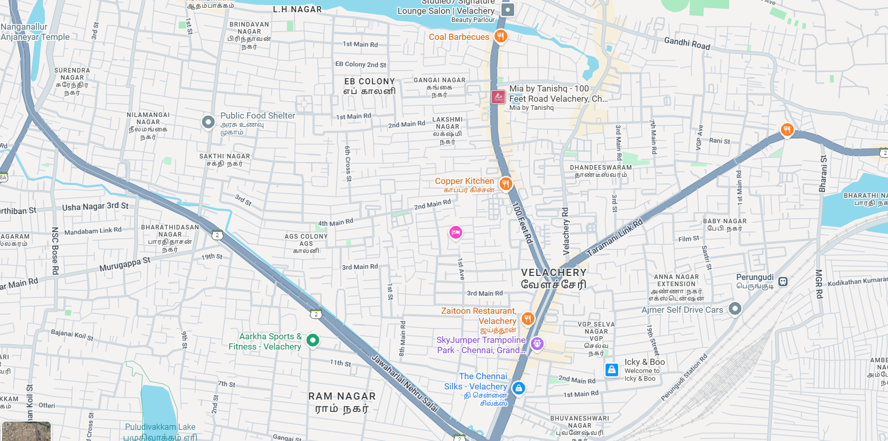

# Ex04 Places Around Me
## Date: 19/11/2025

## AIM
To develop a website to display details about the places around my house.

## DESIGN STEPS

### STEP 1
Create a Django admin interface.

### STEP 2
Download your city map from Google.

### STEP 3
Using ```<map>``` tag name the map.

### STEP 4
Create clickable regions in the image using ```<area>``` tag.

### STEP 5
Write HTML programs for all the regions identified.

### STEP 6
Execute the programs and publish them.

## CODE
```
map.html 

<html>
<head>
<title>My City</title>
</head>
<body>
<h1 align="center">
<font color="red"><b>Velachery</b></font>
</h1>
<h3 align="center">
<font color="blue"><b>Laavanya R (24005572)</b></font>
</h3>
<center>
     
<map name="image-map">
    <area target="" alt="Hotel" title="Hotel" href="hotel.html" coords="1092,447,789,268" shape="rect">
    <area target="" alt="Sports" title="Sports" href="sports.html" coords="370,663,613,756,593,582" shape="poly">
    <area target="" alt="Trampoline" title="Trampoline" href="trampoline.html" coords="983,681,91" shape="circle">
    <area target="" alt="Food Shelter" title="Food Shelter" href="shelter.html" coords="370,166,609,331" shape="rect">
</map>
</center>
</body>
</html>

shelter.html

<html>
<head>
<title>My Home Town</title>
</head>
<body bgcolor="cyan">
<h1 align="center">
<font color="purple"><b>Velachery</b></font>
</h1>
<h3 align="center">
<font color="blue"><b>Food Court</b></font>
</h3>
<hr size="3" color="white">
<p align="justify">
<font face="Georgia" size="5">
    During COVID, a Chennai group collected cooked meals from a hotel in Velachery to distribute to the homeless.
</p>
</body>
</html>

trampoline.html

<html>
<head>
<title>My Home Town</title>
</head>
<body bgcolor="cyan">
<h1 align="center">
<font color="purple"><b>Velachery</b></font>
</h1>
<h3 align="center">
<font color="blue"><b> Trampoline </b></font>
</h3>
<hr size="3" color="white">
<p align="justify">
<font face="Georgia" size="5">
    At SkyJumper, it's not just trampolines — they have foam pits, wall runs, dodgeball, etc. So it's good for both serious jumpers and casual kids and  families.
</p>
</body>
</html>

sports.html

<html>
<head>
<title>My Home Town</title>
</head>
<body bgcolor="cyan">
<h1 align="center">
<font color="purple"><b>Velachery</b></font>
</h1>
<h3 align="center">
<font color="blue"><b> </b></font>
</h3>
<hr size="3" color="white">
<p align="justify">
<font face="Georgia" size="5">
    Whether you're into strength training, cardio, swimming, or specific sports (like badminton), Velachery offers good variety
</p>
</body>
</html>

hotel.html

<html>
<head>
<title>My Home Town</title>
</head>
<body bgcolor="cyan">
<h1 align="center">
<font color="purple"><b>Velachery</b></font>
</h1>
<h3 align="center">
<font color="blue"><b>Hotel</b></font>
</h3>
<hr size="3" color="white">
<p align="justify">
<font face="Georgia" size="5">
    Ziton Hotel is described as a simple, budget-friendly stay offering basic accommodation and comfort for travelers.
</p>
</body>
</html>

```

## OUTPUT

.png>)
.png>)
.png>)
.png>)
.png>)


## RESULT
The program for implementing image maps using HTML is executed successfully.
